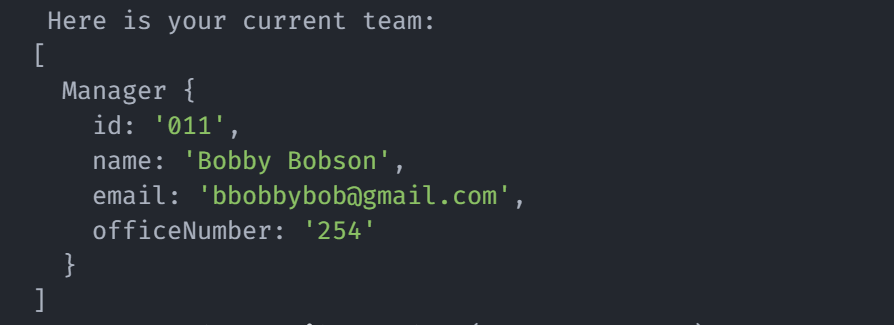
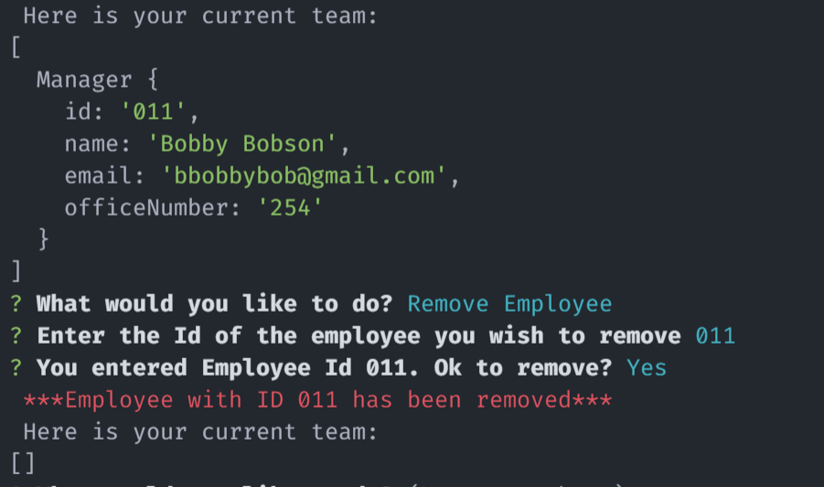
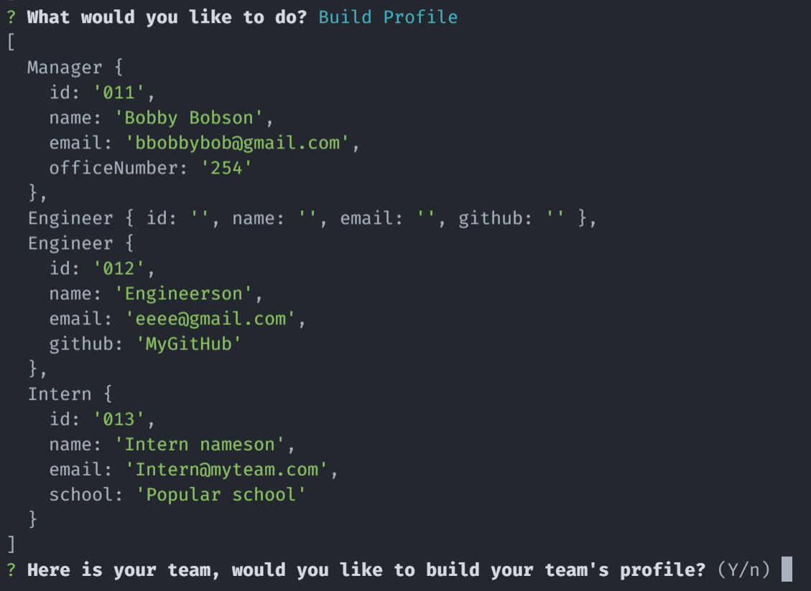
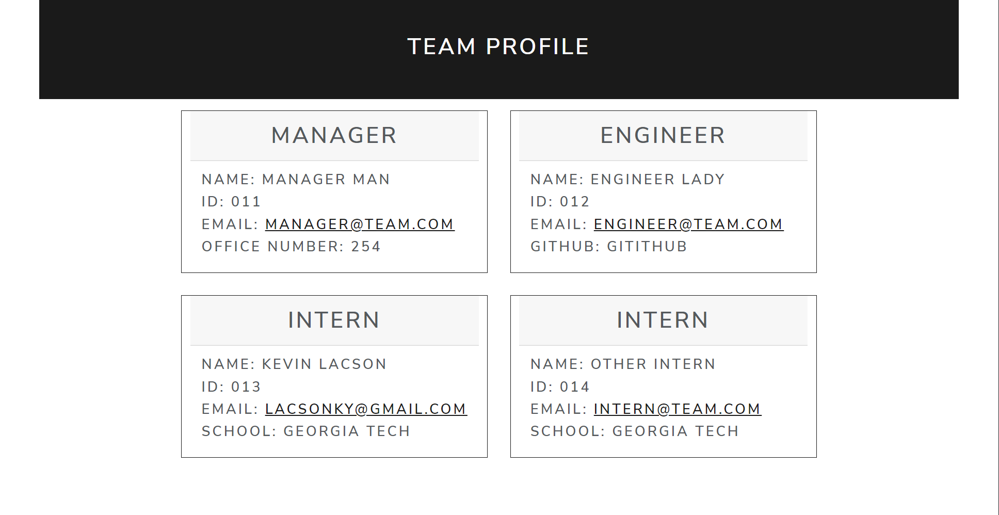

# Team Profile Generator

  
by Kevin Lacson  
Email: lacsonky@gmail.com  
GitHub: [Snackonevil](https://github.com/Snackonevil)

---

## Description

GitHub Repository: [Team-Profile-Generator-Repo](https://github.com/Snackonevil/team-profile-generator)  
Walkthrough video: [Team-Profile-Generator-Walkthrough](https://watch.screencastify.com/v/HYO1PCXDvRDGbtik8N2Q)

This app creates an easily viewed profile page for your team

---

## Table of Contents

-   [Installation](#installation)
-   [Usage](#usage)
-   [Contribute](#contribute)
-   [Test](#tests)
-   [License](#license)

---

## Installation

Requires node modules "Jest" and "Inquirer"  
Run `npm install` in the command line

---

## Usage

`node index.js` or `npm start` in the command line

Begin building team with manager information  

**Note**: Id# and office# must be integers, and emails must be in valid email format

Either Add Employee, Remove Employee, or Build Profile  

After each selection, you are shown your current team  

Remove and employee based on entered ID. If cancelled, you are taken back to the menu.  

Confirm your profile before building. If cancelled, you are taken back to the menu.  

Example Profile Page:  

---

## Contribute

Feel free to make a pull request

---

## Tests

`npm run test`

---

## License

(MIT)
Copyright 2022 Kevin Lacson

Permission is hereby granted, free of charge, to any person obtaining a copy of this software and associated documentation files (the "Software"), to deal in the Software without restriction, including without limitation the rights to use, copy, modify, merge, publish, distribute, sublicense, and/or sell copies of the Software, and to permit persons to whom the Software is furnished to do so, subject to the following conditions:

The above copyright notice and this permission notice shall be included in all copies or substantial portions of the Software.

THE SOFTWARE IS PROVIDED "AS IS", WITHOUT WARRANTY OF ANY KIND, EXPRESS OR IMPLIED, INCLUDING BUT NOT LIMITED TO THE WARRANTIES OF MERCHANTABILITY, FITNESS FOR A PARTICULAR PURPOSE AND NONINFRINGEMENT. IN NO EVENT SHALL THE AUTHORS OR COPYRIGHT HOLDERS BE LIABLE FOR ANY CLAIM, DAMAGES OR OTHER LIABILITY, WHETHER IN AN ACTION OF CONTRACT, TORT OR OTHERWISE, ARISING FROM, OUT OF OR IN CONNECTION WITH THE SOFTWARE OR THE USE OR OTHER DEALINGS IN THE SOFTWARE.
